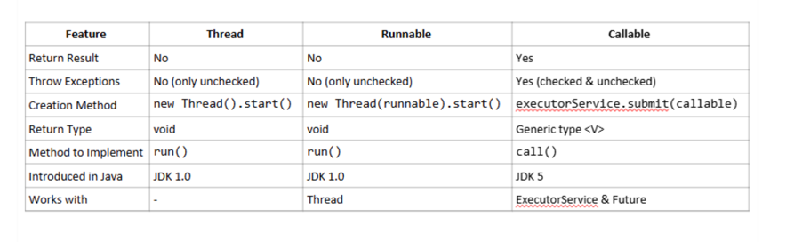
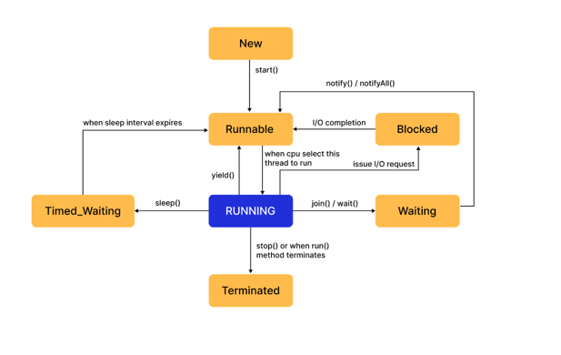
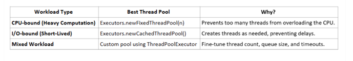
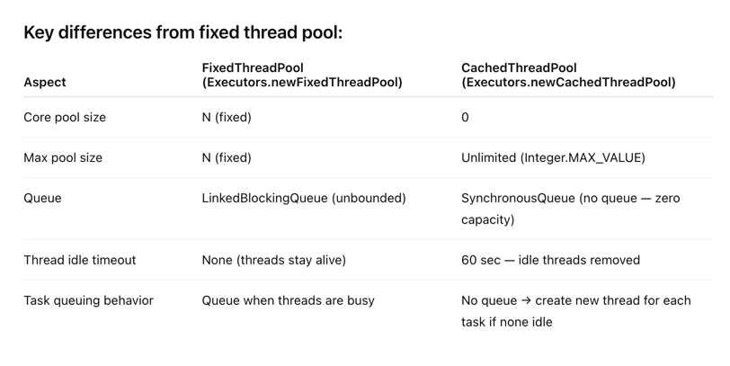
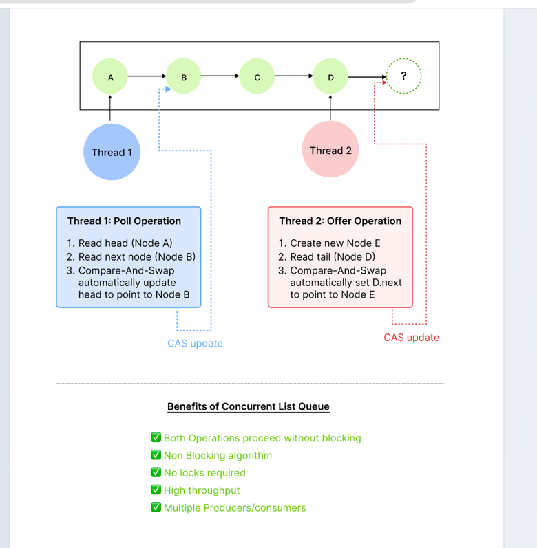
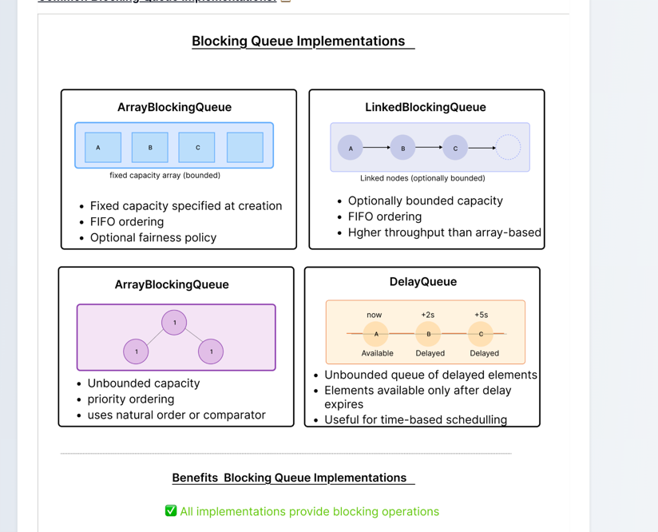
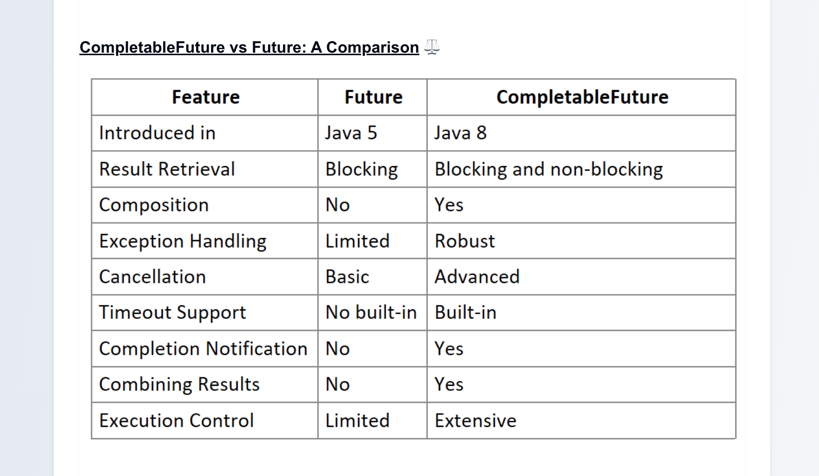

# Multithreading


## Thread
- unit of execution
- shares resources with other threads in the process
- easy context switching
- concurrent programs - diff from parallel
- gives illusion of parallel programming
- used to execute independent tasks in an application
- eg threads in whatsapp for executing background tasks

## Process
- has its own resources
- strong isolation
- independent of other processes
- fault tolerant wrt to crashes of other processes

## Runnable 
- Interface to implement and pass the task to thread
- returns void

## Callable 
- Implement interface and pass to executor service 
- Has return type




## Exceptions

### Checked exceptions

Checked exceptions are exceptions that must be either declared in the method signature using throws or handled using try-catch.
They are checked at compile-time.
Examples:
IOException (e.g., file not found)
SQLException (e.g., database connection failure)
InterruptedException (e.g., thread interruption)

### Unchecked exceptions
Unchecked exceptions are runtime errors that do not require explicit handling.
They are checked at runtime, meaning they occur due to logical errors in the program.
Examples:
NullPointerException (e.g., calling a method on null)
ArrayIndexOutOfBoundsException (e.g., accessing an invalid array index)
ArithmeticException (e.g., division by zero) 


## FAQ

### thread safety
Answer: Thread safety refers to code that functions correctly during simultaneous execution by multiple threads. It can be achieved through synchronization, immutable objects, concurrent collections, atomic variables, and thread-local variables. 🔒 

- Q: What happens if an exception occurs in a thread's run method?

- Answer: If an uncaught exception occurs in a thread's run() method, the thread terminates. The exception doesn't propagate to the parent thread and doesn't affect other threads. ❌ 


## Thead methods

## sleep
- does not release locks

## wait notify notifyAll
- present in all classes 
- always call wait() in a while loop, thread can be woken up without notify
- can be called from synchronised blocks only
- releases lock while waiting waits for lock on the object to be released 
- when notify or notifyAll is called by holding threads
- [Example](/Users/manmeetkc/Multithreading/src/main/java/WaitNotifyExample.java)
### What happens when notify is called
- When notify() or notifyAll() is called, the waiting thread does not immediately start running. Instead, it follows these steps:

- When another thread calls notify(), one waiting thread is moved to the Blocked (or Runnable) State, but it does not start execution immediately.
- The notified thread cannot resume execution until it successfully acquires the lock on the synchronized object.
- If multiple threads are waiting, only one gets notified by notify(), while notifyAll() wakes up all waiting threads (but they still compete for the lock).
Once the thread reacquires the lock, it continues execution from where it called wait(). 


## Thread Lifecycle



### States

- blocked: trying to access locked resource, or maybe I/O
- waiting: to be notified
- Entered via methods like Object.wait(), Thread.join(), or LockSupport.park() 
- yield()
  - The current thread calls Thread.yield().

  - The thread remains runnable, but tells the scheduler:

  - If other threads of equal priority are ready → schedule them.

  - If no others are ready → current thread may continue running.
  - It does not release any locks.

  - It does not block or wait like wait() → the thread stays runnable.

  - It is a cooperative hint, not a guarantee.
## Synchronised keyword

- If its declared on a method, then the current instance of the object is locked
- synchronized instance methods → lock instance → one thread per object

- synchronized static methods → lock class → one thread per class


## Thread pools

- Reusing of threads
- Dont create threads again and again
- Thread pool - execute what you can and put the rest of the runnables in queue

### Good practices while using threadpools

- handle interrupted exception
- wait with a timeout to avoid leaks

### Thread pools which type to use

- fixed thread pool
  - CPU-intensive tasks → Executors.newFixedThreadPool(n)
  - CPU-bound tasks (like image processing, video encoding, or complex calculations) spend most of their time using the CPU, rather than waiting for external resources.
  - Too many threads can lead to excessive context switching, slowing down performance.
  - A fixed number of threads (equal to the number of CPU cores) ensures that CPU resources are fully utilized without excessive overhead.
- cached thread pool
  - I/O-bound tasks (like web scraping, database queries, file I/O) spend most of their time waiting.
  - Threads are created dynamically as needed, avoiding delays due to waiting.
  - If a thread is inactive, it is reused instead of creating a new one, reducing overhead. 
  - I/O bound will wait, if we use fixed threads might just be waiting wasting resources, cached threadpool will dynamically create new threads
  - The cached thread pool automatically manages thread creation and termination. 
  - Idle threads are reclaimed after a period of inactivity (typically 60 seconds), reducing resource consumption when the system is less busy. With a fixed thread pool, the threads exist for the lifetime of the executor, even if they are often idle. 

  
### Thread pool executor for custom threadpools

``ExecutorService executor = new ThreadPoolExecutor(
4, 8, 30L, TimeUnit.SECONDS,
new LinkedBlockingQueue<>(10))``

```java
public ThreadPoolExecutor(int corePoolSize,
                              int maximumPoolSize,
                              long keepAliveTime,
                              TimeUnit unit,
                              BlockingQueue<Runnable> workQueue)
```


- Configure queue size carefully
  - too large: too much delay
  - too small: too much rejection
- Name threads for easier debugging
  - thread factory to define how to create new thread in the pool
```java

AtomicInteger threadNumber = new AtomicInteger(1);

ExecutorService executor = Executors.newFixedThreadPool(2, runnable -> {
        Thread thread = new Thread(runnable);
        thread.setName("CustomThread-" + threadNumber.getAndIncrement());
        return thread;
        });


```

Cached thread pool internally creates:

```java
new ThreadPoolExecutor(
    0, // corePoolSize
    Integer.MAX_VALUE, // maximumPoolSize → unlimited threads!
    60L, TimeUnit.SECONDS, // keepAliveTime → idle threads are killed after 60s
    new SynchronousQueue<Runnable>() // THIS queue — no capacity!
)
```

Fixed threadpool internally creates:

- threads are also created as needed, as and when the tasks are submitted

```java
new ThreadPoolExecutor(
        inputSize,
        inputSize,
        0L, TimeUnit.MILLISECONDS,
        new LinkedBlockingQueue<Runnable>(100) // bounded queue of size 100
        )
```


Here is the **most concise version** of the `.md` — clear and minimal, keeping only the core flow:

````markdown
### ThreadPoolExecutor + Worker Flow (Concise)

## Flow

1. **Task Submission**
    - `executor.submit(runnable)` → task added to queue

2. **Worker Creation**
    - If needed: `Worker` created with `firstTask`
    - `Thread thread = new Thread(worker)` → `thread.start()`

3. **Worker Execution**
    - `Worker.run()` → calls `runWorker(this)`
    - Loop:
      ```java
      while ((task = getTask()) != null) {
          task.run();
      }
      ```

4. **Shutdown**

### `shutdown()`
- No new tasks accepted
- Existing + queued tasks finish
- Workers exit when queue empty → pool TERMINATED

### `shutdownNow()`
- No new tasks
- Attempts to interrupt running workers
- Clears queue → returns unprocessed tasks

```java
if (isShutdown && queue.isEmpty()) return null; // thread exits
````

### `awaitTermination()`

* Blocks until pool TERMINATED or timeout
* Basically execution wont go to next line of code


```java
executor.shutdown();
executor.awaitTermination(timeout, unit);
```

### Key Points

* `Worker` passed to thread **once**
* Thread loops → runs many tasks one at a time
* At most **N** tasks run concurrently (`FixedThreadPool(N)`)
* Threads reused, not recreated per task
* Shutdown supports graceful or forceful termination

### thread starvation

- Thread starvation occurs when threads are unable to gain regular access to shared resources and make progress. 
- Thread pools help prevent this by controlling the number of active threads and implementing fair scheduling policies

### Thread pool code structure

#### Executor
- parent interface
- only execute method
#### ExecutorService
- interface

#### AbstractExecutorService
- implements some methods of executor service

#### ThreadPoolExecutor 
- extends AbstractExecutorService
- Monitoring : active count, queue size

#### Executors 
- Factory class
- provides method to create ThreadPoolExecutor

#### ScheduledExecutorService
- interface 
- cron like functionality - can submit tasks to execute at particular time/interval

#### execute vs submit

- submit returns future: visibility around what happened when task was executed
- execute doesn't return anything no visibility

#### invokeAll(Collection<? extends Callable<T>> tasks): 
- Runs all tasks in parallel. Waits until all finish. You get a list of Futures.
- If one task fails, its Future will throw an exception on get(), but others keep running.
- If the executor shuts down in the middle, only the remaining tasks are interrupted.
- Machine crash = all tasks in memory are lost.

## Thread synchronisation

Making sure threads access shared methods in a controlled manner.

### Synchronised method:

Can declare entire method as synchronised. The lock is taken on the object of the class.
In case of static class, lock is taken on class.
Only one method at a time can execute any of the synchronised methods

### Synchronised block
can pass the object to acquire lock on. 
more fine grained
The primary reason to choose a synchronized block over a synchronized method is when you have additional work in the method that doesn’t need to be synchronized. This allows concurrent threads to execute the non-critical sections without waiting for the lock

### Volatile keyword
indicate value will be changed by multiple threads
Ensures:

- visibility: changes made on volatile variables get flushed to main memory instead of thread's local cache
- ordering: makes sure jvm wont reorder instructions relative to the volatile variable instructions

```markdown
getInstance() is a static method to return the Singleton instance.

new Singleton() calls the constructor (even if not explicitly written).

instance = new Singleton() involves:

Allocate memory

Set instance reference

Run constructor to initialize fields

Without volatile, CPU/JVM may reorder steps 2 & 3.

Another thread may see instance != null but fields uninitialized.

With volatile, ordering is enforced: fields initialized before instance is visible.

This ensures safe publication of Singleton.
```


#### Where to use volatile?

State/flag variables
Singleton Patterns (with double-checked locking)

```java
if (instance == null) {             // First check (no locking)
synchronized (Singleton.class) {
        if (instance == null) {     // Second check (with locking)
        instance = new Singleton();
        }
        }
        }

```

instance is volatile here
only require visibility guarantees -> use volatile

### Atomic Variables:

You should use atomic variables when you need to perform simple operations(like incrementing, decrementing, or updating) 
on shared variables in a multithreaded environment. 
They are especially useful when the overhead of locking is undesirable 🐢 and when the logic remains limited to single-step atomic operations


## Thread Communication
wait()
notify()
notifyAll()

work with the thread's monitor(intrinsic lock on object)

These methods must be called from within a synchronized context (a synchronized block or method) on the same object 
whose monitor the thread is waiting on. They work together with a shared condition (often a flag or another shared variable) that threads check in a loop to handle spurious wakeups


### Producer consumer problem example

We have a queue, one thread is producer one is consumer.
Our condition is that producer should produce until queue is full
And consumer should only consume until queue is empty

## Locks and Types of Locks


Why use locks over synchronised?
- in synchronised we lock and wait if lock is not acquired, the thread is blocked. 
- with locks we can do if not acquired do something else
- Thread blocked while using synchronised cannot be interrupted
- Timed locks - timeouts
- Fairness, thread scheduling is upto jvm. With reentrant lock we can do FCFS
- Read/write locks

ReentrantLock - popular implementation
- One thread can lock it twice without causing deadlock
- Interruptibility: lock.lock would normally block the thread until lock is available, however if we do lock.lockInterruptibly it can get interrupted
- tryLock and tryLock with timeout
- have to unlock, in a finally block usually


## Semaphore

- Gives number of permits
- acquire() decrease count if not 0 or block until you get
- release() increase count (can increase without acquiring)
- Used to manage resource pools, limit number of threads that can access 
- Signalling
```java
import java.util.concurrent.Semaphore;

public class SimpleSignalExample {
  static Semaphore signal = new Semaphore(0); // initially 0 → A will block

  public static void main(String[] args) {
    // Thread A
    Thread threadA = new Thread(() -> {
      System.out.println("Thread A: Waiting for signal...");
      try {
        signal.acquire(); // will block until release() is called
      } catch (InterruptedException e) {
        Thread.currentThread().interrupt();
      }
      System.out.println("Thread A: Got signal! Proceeding.");
    });

    // Thread B
    Thread threadB = new Thread(() -> {
      System.out.println("Thread B: Preparing data...");
      try {
        Thread.sleep(2000); // simulate some work
      } catch (InterruptedException e) {}
      System.out.println("Thread B: Data ready. Sending signal.");
      signal.release(); // send signal → unblock A
    });

    threadA.start();
    threadB.start();
  }
}

```

- Binary semaphore(with permit 1) act as mutex ensuring only 1 thread at a time can access the resource


## Java Concurrent Collections

### Concurrent Hashmap

#### Hashmap internal
- Uses array of buckets - hash the key, if there is collision, add to linked list. 
- Node<K,V> stored in bucket. 
- Iterate through key when get() is called.

#### Thread safety
- Hashmap itself is not threadsafe. We need to take lock on it or use synchronised(same thing) to make it thread safe.
- The whole map is locked when we use ```Collections.synchronisedMap(new HashMap<>())```
- Because we need to put it in a synchronised block while iterating through it.
- In concurrent hashmap the buckets themselves are locked while writing. More fine grained. No need to take explicit locks.


### CopyOnWriteArrayList

ArrayList is not thread safe. If one thread is adding to the list while another is iterating through it, there will be errors or data inconsistency

CopyOnWriteArrayList 
- whenever there is a modification it copies the original list 
- changes it
- Changes the reference of the list to the new list
The above three operations are done atomically with Reentrant locks
If there is thread iterating through it is iterating through the previous snapshot, which was there when the iterator was created


### ConcurrentLinkedQueue

LinkedList is used as a queue and it implements the queue interface. It internally uses doubly linked list and is not thread safe.
ConcurrentLinkedQueue uses singly linked list and uses atomic compare and swap operations to ensure thread safety.
#### Compare And Swap 

```java 
AtomicReference<Node> atomicNode = new AtomicReference<>(currentNode); 
boolean isUpdated = ref.compareAndSet(currentNode, newNode);

```
it will only set when ref holds currentNode otherwise will return false.

#### CAS in ConcurrentLinkedQueue
```java
last = tail;

Node newNode = new Node();

if CAS(last.next, null, newNode){
    if CAS(tail, last, newNode)
        }
else{
    
        }

```

Enables all writes to go through eventually, and synchronously. Does not lock anything. 


### BlockingQueue(Interface)
ConcurrentLinkedQueue is not blocking. If there is nothing in the queue it will return null.
However in producer consumer pattern we want consumer thread to be blocked until there are elements to consume and producer to be blocked
until queue is non-full.

Different types of blocking queue implementations




## Future and CompletableFuture

**Future** is basically blocking, returned by ExecuterService. 
Need to block for the result.
Does not support chaining (i.e do x after y is done)
No exception handling
No completion notification
Can be cancelled, if the method is watching for an interrupt signal

```java
Future<?> future = executor.submit(() -> {
		    while (true) {
		        if (Thread.interrupted()) {
		            System.out.println("Task was interrupted. Stopping...");
		            break;
		        }
		        // Simulate work
		    }
		});
		future.cancel(true);  // sends interrupt
```

**CompletableFuture**
Addresses above challenges
supplyAsync(method to execute)
thenAccept(method to execute when it completes, consumer types no return type)

```java
CompletableFuture.supplyAsync(() -> {
            try {
                Thread.sleep(1000); // Simulate a delay
            } catch (InterruptedException e) {
                Thread.currentThread().interrupt();
            }
            return "Result from CompletableFuture";
        })
        // Register a callback that processes the result once it's ready.
        .thenAccept(result -> {
            System.out.println("CompletableFuture result: " + result);
            // Additional operation after the result is available.
            System.out.println("Processing after CompletableFuture result");
        });
        // Optionally do other work here while the asynchronous task is running.
        System.out.println("Main thread is free to do other tasks while waiting...");
        // To prevent the main thread from exiting immediately,
        // we'll wait for the CompletableFuture to complete.
        try {
            Thread.sleep(2000); // Wait enough time for the async task to finish
        } catch (InterruptedException e) {
            Thread.currentThread().interrupt();
        }
```

has get()(throws checked exception) and join()(throws unchecked exception) basically blocking.

complete() - manually complete a future, if the future is already completed, complete() will return false

isDone() - will check if completed

thenApply() -> maps the result into smth else. 

```java
CompletableFuture<String> future = CompletableFuture.supplyAsync(() -> "42");
CompletableFuture<Integer> intFuture = future.thenApply(s -> Integer.parseInt(s));

```
thenCompose() if the function needs to return a CompletableFuture use this
```java
CompletableFuture<String> future = CompletableFuture.supplyAsync(() -> "userId");

CompletableFuture<User> userFuture = future.thenCompose(id -> fetchUser(id));

```
Can also add timeouts to futures and return default values. 



